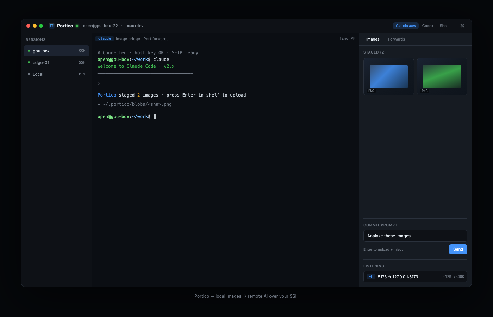

# Portico

[English](README.md) | [简体中文](README.zh-CN.md)

**Cross-platform desktop SSH terminal** with a first-class bridge for **pasting local images into remote AI coding CLIs** (Claude Code, Codex).

Copy a screenshot on your Mac → Portico uploads it over your own SSH/SFTP session → injects a provider-aware path prompt into the remote terminal. **Cloudless by default:** every byte travels over your SSH connection.



| | |
| --- | --- |
| **Version** | `0.1.0` (MVP) |
| **Stack** | Electron · React · xterm.js · ssh2 · node-pty |
| **License** | MIT |
| **Repo** | [SivanCola/Portico](https://github.com/SivanCola/Portico) |

## Why Portico?

Remote AI CLIs run on a server; your screenshots live on the laptop. Portico closes that gap without a third-party image host:

1. **Stage** images from the clipboard (`⌘/Ctrl+Shift+V`) or multi-file drop.
2. **Commit** from the Image Shelf — SFTP upload to a content-addressed path.
3. **Inject** the right text for Claude / Codex / shell (auto-detected, overridable).

Beyond the image bridge, Portico is a full multi-tab terminal: local shell or SSH, port forwards, session restore, and remote clipboard sync.

## Features

| Area | What you get |
| ---- | ------------ |
| **Image → remote AI** | Multi-image stage/commit, compress oversized images, Claude / Codex / shell adapters |
| **Sessions** | Local PTY or SSH; multi-tab rail; optional session restore on launch |
| **SSH** | Password / key / agent; `~/.ssh/config` friendly; host-key check against `known_hosts` |
| **tmux** | Attach-if-exists or always; re-attach after restore |
| **Port forwarding** | Local (`-L`), remote (`-R`), SOCKS5 (`-D`); traffic counters; one-click forward for sniffed `localhost` URLs |
| **Clipboard** | OSC 52 remote → Mac clipboard; optional tmux `set-clipboard` assist |
| **UI** | Command palette, image shelf, settings center, EN / 简体中文 |
| **Modes** | **Terminal only** — plain terminal (image bridge, PF, provider detect off) |
| **Updates** | Dual channel (stable / beta); GitHub Releases feed via `electron-updater` |

### Image handoff model (MVP)

The reliable baseline is **file-path-based**: the remote AI reads

```text
~/.portico/blobs/<sha256>.<ext>
```

(or `~/.portico-beta/blobs/...` on the beta channel). Native clipboard-image simulation and a remote `portico-agent` helper are **out of scope** for this version.

Provider adapters (`src/shared/adapters.ts`):

| Provider | Interactive session | Command mode |
| -------- | ------------------- | ------------ |
| Claude | `Analyze this image: <path>` | same |
| Codex | `<prompt>: <path>` (path fallback) | `codex -i <path> "<prompt>"` |
| Shell | `# image uploaded to <path>` | same |

Detection is heuristic (banner / process name) and can be overridden from the top-bar provider pills.

## Install

Download a published build from:

```text
https://github.com/SivanCola/Portico/releases
```

| Platform | Artifact |
| -------- | -------- |
| macOS Apple Silicon | `Portico-*-arm64.dmg` / `-arm64-mac.zip` |
| macOS Intel | `Portico-*.dmg` / `-mac.zip` |
| Windows | `Portico.Setup.*.exe` |
| Linux | `Portico-*.AppImage`, `portico_*_amd64.deb` |

Or build from source below.

### macOS: “cannot be opened” / damaged / Gatekeeper?

Current releases are **not** Apple Developer ID–signed or notarized, so macOS may block the app after download (“Apple could not verify Portico…” / “damaged”).

If you installed from [GitHub Releases](https://github.com/SivanCola/Portico/releases) into `/Applications`, quit Portico, then run:

```bash
sudo xattr -rd com.apple.quarantine /Applications/Portico.app
```

For **Portico Beta**:

```bash
sudo xattr -rd com.apple.quarantine "/Applications/Portico Beta.app"
```

Then open the app again (or: right-click the app → **Open**, or **System Settings → Privacy & Security → Open Anyway**).

## Develop

Requirements: **Node.js 20+**, npm.

```bash
npm install
npm run dev          # electron-vite — stable channel app
npm run dev:beta     # same, beta channel identity
npm run build        # main + preload + renderer → out/ (stable)
npm run build:beta
npm run typecheck    # tsc for node + web
npm test             # vitest
```

### Packaging (local)

```bash
npm run dist:stable   # → dist/stable
npm run dist:beta     # → dist/beta
# or unpackaged dir only:
npm run pack:stable
npm run pack:beta
```

## Key bindings

| Shortcut | Action |
| -------- | ------ |
| `⌘/Ctrl + Shift + P` | Command palette |
| `⌘/Ctrl + Shift + V` | **Stage** clipboard image(s) locally (no upload yet; repeat for more) |
| `Enter` in Image Shelf commit bar | Upload staged images, inject paths, submit to Claude/Codex |
| `⌘/Ctrl + \` | Toggle tool sidebar (image shelf + port forwards) |

More actions live in the command palette (updates, clear remote cache, tmux, open forward in browser, …).

## Port forwarding

Enable under **Settings → Port forwarding**. Rules live in the right-hand tool sidebar.

| Mode | Meaning | Typical use |
| ---- | ------- | ----------- |
| Local (−L) | This machine listens → tunnel to host:port **on the server** | Claude Code / Vite / Next preview on the remote host |
| Remote (−R) | Server listens → tunnel back to a service **on this machine** | Webhooks, local agents |
| SOCKS (−D) | This machine runs a **SOCKS5** proxy over SSH | Browse / curl as if from the remote host |

**SOCKS example** — dynamic forward on local port `1080`:

```bash
curl --socks5-hostname 127.0.0.1:1080 https://ifconfig.me
# or system / browser proxy: socks5://127.0.0.1:1080
```

Each rule shows live **traffic counters** (↑ local→remote, ↓ remote→local). Click a row counter to reset that rule, or **Reset traffic** for the whole session.

**Remote dev server workflow**

1. Connect over SSH and start a server (e.g. Claude Code opens `localhost:5173` on the host).
2. Portico sniffs terminal output for URLs like `http://localhost:5173` and offers **one-click Forward**.
3. Or add a rule manually: local port → `127.0.0.1` : remote port (same port both sides by default).
4. Click the browser icon on a listening local forward, or use the palette **Open port forward in browser**.

Rules are **persisted per session tab** (with host/tmux restore), survive intentional disconnect (shown as *stopped*), and rebind on reconnect. Options:

- **Same port both sides** / **Auto local port** when the preferred local port is busy
- **Pause / resume** a single rule without deleting it
- **Advanced**: label, bind address (`127.0.0.1` default; `0.0.0.0` exposes LAN — use carefully)
- Cross-tab collision detection for the same local listen port

Disable under **Settings → Port forwarding**, or use **Terminal only** to turn off image bridge + port forwards + provider detect together.

## Session restore

Portico saves the left-rail tab layout to `userData/sessions.json` (**no passwords**). On launch it can:

- reopen tabs and auto-reconnect SSH (key or agent)
- `tmux attach` to each tab’s last tmux session
- restore that tab’s **port-forward rules**

Toggle under **Settings → Restore sessions on launch**.

## Storage

Remote blobs are content-addressed:

```text
~/.portico/blobs/<sha256>.<ext>        # stable
~/.portico-beta/blobs/<sha256>.<ext>   # beta
```

Re-pasting the same image is a no-op. **Clear Remote Portico Cache** in the command palette deletes them. Soft cap: **8 MiB** per image (recompress / downscale when oversized); up to **20** images per stage.

## Architecture

```text
src/
  shared/       types, IPC contract, constants, adapters, hashing (env-agnostic, unit-tested)
  main/         Electron main: SSH/SFTP, local PTY, clipboard, blob upload, port forwards, updates
  preload/      contextBridge: typed window.portico API
  renderer/src/ React + xterm.js: sessions, terminal, image shelf, settings, i18n
```

## Release channels

Channel is selected at build time via `PORTICO_RELEASE_CHANNEL` (`stable` is default):

| Channel | App name | appId | Remote blob dir | Update feed | Output dir |
| ------- | -------- | ----- | --------------- | ----------- | ---------- |
| stable | Portico | `com.portico.app` | `~/.portico/blobs` | `latest` | `dist/stable` |
| beta | Portico Beta | `com.portico.app.beta` | `~/.portico-beta/blobs` | `beta` | `dist/beta` |

Stable and Beta are fully isolated (app identity, `userData` / `localStorage`, remote caches) so both can be installed side by side.

### Auto-updates

Packaged builds check GitHub Releases for [SivanCola/Portico](https://github.com/SivanCola/Portico). Beta auto-downloads new **prereleases** and prompts to restart; stable only receives **latest** releases. In development, update checks report “updates disabled in dev.” Palette: **Check for Updates** / **Restart to Install Update**.

### Releasing

Tag-driven CI (`.github/workflows/release.yml`):

| Tag | Channel | GitHub Release |
| --- | ------- | -------------- |
| `vX.Y.Z` (e.g. `v0.1.1`) | stable | normal release → `latest` feed |
| `vX.Y.Z-beta.N` (e.g. `v0.1.1-beta.1`) | beta | **prerelease** → `beta` feed |

The workflow requires `package.json` `version` to equal the tag (minus `v`) before building, so updater metadata never carries the wrong version.

```bash
# example: cut a stable release after bumping package.json to 0.1.1
git tag v0.1.1
git push origin v0.1.1
```

## Test plan mapping

| Concern | Where |
| ------- | ----- |
| Clipboard stage (bitmap + files) → commit | `src/main/clipboard.ts`, `portico-controller.ts` (`stage` / `commitStaged`) |
| Spaces / non-ASCII paths | `src/shared/hash.test.ts` (`shellQuote`, `blobPath`) |
| Reconnect-safe teardown | `src/main/ssh-session.ts` (`disconnect`) |
| Claude / Codex adapters | `src/shared/adapters.test.ts` |
| Oversized-image compress / reject | `src/main/clipboard.ts` (`normalizeNative`) + `blob-uploader.ts` |
| Normal text paste | terminal `onData` → `sendInput` |
| Port forwards / SOCKS | `src/main/port-forwarder.ts`, `socks5.ts` |
| Session restore | `src/main/session-store.ts` |
| Host keys | `src/main/host-key.ts` |
| OSC 52 clipboard | `src/main/osc52.ts` |

## License

MIT.
